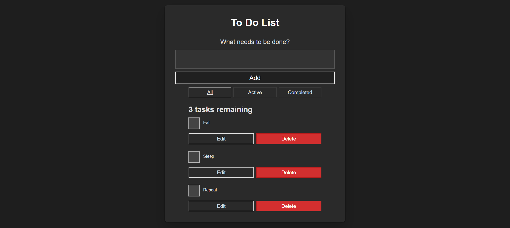

# To Do List

- A simple, interactive to-do list application built with React. This project demonstrates state management, component composition, and basic event handling in React.
- ---
- **Features:**
- Add, edit, and remove tasks dynamically.
- Mark tasks as completed and toggle their status.
- Filter tasks by status: All, Active, or Completed.
- Interactive UI with accessibility considerations (keyboard navigation, focus management).
- Unique IDs for tasks using nanoid.



---
# App.js Overview / Notes

**Imports**
```javascript
// Todo, Form, and FilterButton: Custom components that encapsulate parts of the UI
import { useState, useRef, useEffect } from "react";
import { nanoid } from "nanoid";
import Todo from "./components/Todo";
import Form from "./components/Form";
import FilterButton from "./components/FilterButton";
```
**usePrevious Hook**
```javascript
// Stores the previous value of a state variable (tasks.length in this case)
function usePrevious(value) {
  const ref = useRef();
  useEffect(() => {
    ref.current = value;
  });
  return ref.current;
}
```
**Filter Logic**
```javascript
// Defines filtering criteria for tasks
const FILTER_MAP = {
  All: () => true,
  Active: (task) => !task.completed,
  Completed: (task) => task.completed,
};

const FILTER_NAMES = Object.keys(FILTER_MAP);
```
**Filter Logic**
```javascript
// Main component that manages the to-do list
function App(props) {
  const [filter, setFilter] = useState("All");
  const [tasks, setTasks] = useState(props.tasks);

```
**CRUD Operations**
```javascript
// Creates a new task with a unique ID, user-provided name, and completed: false by default
function addTask(name) {
  const newTask = { id: `todo-${nanoid()}`, name, completed: false };
  setTasks([...tasks, newTask]);
}

// Toggling Task Completion
// Finds the task with the given id and flips its completed status
function toggleTaskCompleted(id) {
  const updatedTasks = tasks.map((task) =>
    id === task.id ? { ...task, completed: !task.completed } : task
  );
  setTasks(updatedTasks);
}

// Deleting a Task
// Filters out the task with the given id
function deleteTask(id) {
  const remainingTasks = tasks.filter((task) => id !== task.id);
  setTasks(remainingTasks);
}

// Editing a Task
// Finds the task by id and updates its name
function editTask(id, newName) {
  const editedTaskList = tasks.map((task) =>
    id === task.id ? { ...task, name: newName } : task
  );
  setTasks(editedTaskList);
}
```
**Generating UI Elements**
```javascript
// Filters the tasks based on the selected filter (All, Active, Completed)
// Maps each task to a Todo component, passing down task details and callback functions
const taskList = tasks
  .filter(FILTER_MAP[filter])
  .map((task) => (
    <Todo
      id={task.id}
      name={task.name}
      completed={task.completed}
      key={task.id}
      toggleTaskCompleted={toggleTaskCompleted}
      deleteTask={deleteTask}
      editTask={editTask}
    />
  ));
```
**Accessibility & State Preservation**
```javascript
// Updates the heading dynamically based on the number of task
// Ensures focus shifts to the heading when a task is deleted
const tasksNoun = taskList.length !== 1 ? "tasks" : "task";
const headingText = `${taskList.length} ${tasksNoun} remaining`;
const listHeadingRef = useRef(null);
const prevTaskLength = usePrevious(tasks.length);

useEffect(() => {
  if (tasks.length < prevTaskLength) {
    listHeadingRef.current.focus();
  }
}, [tasks.length, prevTaskLength]);
```
